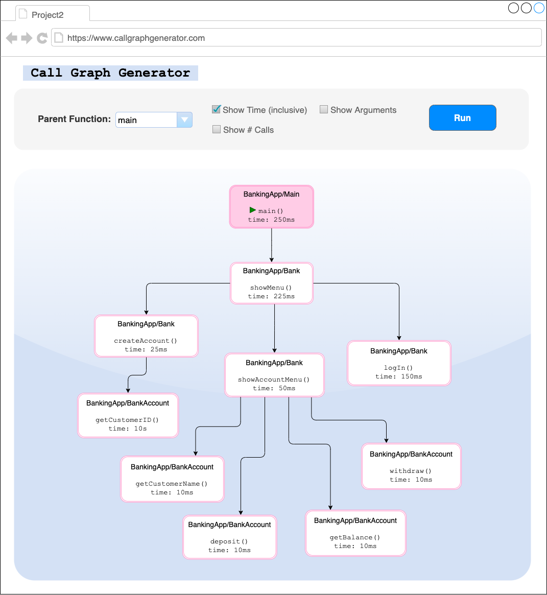
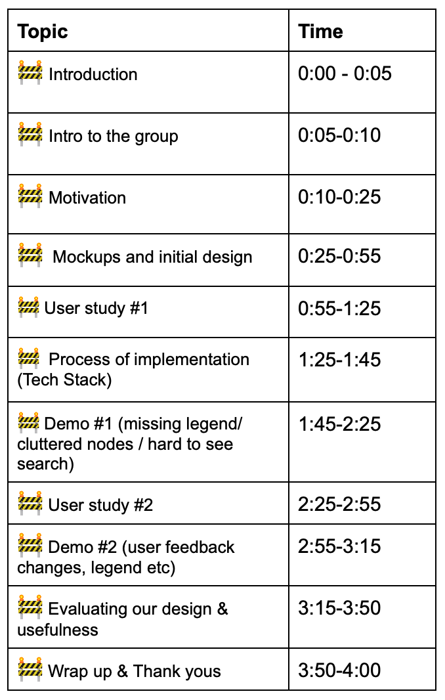

# Milestones

Use this file to commit information clearly documenting your milestones'
content. If you want to store more information/details besides what's required
for the milestones that's fine too. Make sure that your TA has had a chance to
sign off on your milestones each week (before the deadline); typically you
should discuss your material with them before finalizing it here.

## Table of Contents

- [Milestone 1](#milestone-1)
- [Milestone 2](#milestone-2)
- [Milestone 3](#milestone-3)
- [Milestone 4](#milestone-4)
- [Milestone 5](#milestone-5)

## Milestone 1

### Brief description of discussion within the team 🗣️:

- Since we are staying with the same group, we reflected on project 1
- Went over the requirements for Project 2
- Brainstormed some Program Analysis ideas that the team is interested in building for the next few weeks
- Discussed possible tech stacks for frontend and backend

### Our team brainstormed the following ideas for project 2 💡:

- ⭐ **Call graph generator (Current Candidate)**
  - Dynamic/Static analysis
  - From main, how are functions being called
  - How are they related
  - Overview of execution workflow
  - Can speed up the onboarding process for new hires
- Program security & vulnerability analyzer
  - Lack of rate-limiting on APIs
  - Input validation checker
- Code quality analyzer
  - Checking for code duplication and other code smells
  - Un-refactored code
  - Long lines/functions, etc.
- DIY debugger, state at given instance
  - Track values of variables at set breakpoints
  - Identify aspects of program execution in local and global scope
  - Trace allocation of memory/stack
- Coupling detector
  - Identify the degree to which classes are coupled in your program
  - To help identify violations of the Single Responsibility Principle and other code smells

### Project Proposal ✨:

**CallGraphGenerator:**

Our program analysis tool is designed for the use case of a new developer onboarding in a large corporation with a huge codebase. Often a brand new code base is hard to understand and takes a lot of time for a developer to familiarize themselves with the code and subsequently contribute to it. By using our tool, they can visualize call executions to get a better sense of how the program runs as a whole. It may make it easier to pinpoint where changes need to be made when given a task. They would be able to visualize dependencies between functions and the amount of time the program spends in each function to detect coupling and inefficiencies.

Our tool will be designed to target Java and will include dynamic checks due to the nature of method calls (overloading). The visualization dashboard will be built using React and be highly interactive and accessible to allow for using filters, sorting, and other graph manipulations all through the developer's browser without the need for extra tools and software.

### Proposed Tech Stack 🛠️:

Even though we are still in the beginning stages of brainstorming our project idea, we proposed the following tech stack (subject to change upon more research).

- Frontend: React with JavaScript
- Backend: Java

### TA Feedback on Ideas 👨‍🏫:

- Before talking to Zack, we weren't sure if dynamic checking and our proposed tech stacks were the right choices for our project. He helped us confirm that they were good choices, and we will be moving forward with them for our project.
- We also discussed with our TA about possible features we could add to our tool with dynamic checking, as we have access to more data and thus more possibilities to analyze. Examples discussed are below:
  - Include the time different components take to execute
  - What branch was taken in the control flow
  - Why we took a certain path
  - What line of code a call came from (ex. what line in a branch)
  - What the arguments to a call were.

All of these can be displayed in an interesting way in our visualization component.

- Our final discussion was about how the user would use the tool. Again, there are many possibilities. Some of the ones suggested are below:
  - Show all call graphs starting from some function inputted by the user
  - Show overall view of the whole program (However, the tree could be overwhelming and messy to look at)
  - Use querying/filtering to filter out particular call graphs (Ex. more than 5s spent in this function, where the input was bad etc.)

### Planned follow-up tasks 📍:

- Finalize project idea (design and complexity)
- Research and decide on possible tech stacks to use
- Incorporate any TA feedback on our top idea choice into our design choices and research
- Brainstorm more creative names for our project

## Milestone 2

### Description of planned program analysis ideas ✨

**CallGraphGenerator:**

Our program analysis tool is designed for the use case of a new developer onboarding in a large corporation with a huge codebase. Often a brand new code base is hard to understand and takes a lot of time for a developer to familiarize themselves with the code and subsequently contribute to it. By using our tool, they can visualize call executions to get a better sense of how the program runs as a whole. It may make it easier to pinpoint where changes need to be made when given a task. They would be able to visualize dependencies between functions and the amount of time the program spends in each function to detect coupling and inefficiencies.

Our tool will be designed to target Java and will include dynamic checks due to the nature of method calls (overloading). The visualization dashboard will be built using React and be highly interactive and accessible to allow for using filters, sorting, and other graph manipulations all through the developer's browser without the need for extra tools and software.

Proposed Tech Stack:

- Frontend: React with JavaScript
- Backend: Java

### Notes of any important changes/feedback from TA discussion 👨‍🏫:

- We discussed what the task-driven user study should look like. Zack suggested that we have an example Java code, and a mock-up of the corresponding call graph visualization that our tool would output. The key point is that we want to find out whether our tool is helpful for the use case we have outlined - does our tool help an onboarding developer get familiar with a new code base? We can ask the user questions like:
  - Based on this call graph, what do you understand about the java program?
  - Are you able to observe any bugs/buggy behaviour based on this call graph?
  - Say you are given a task to add a new feature to the program. With this call graph, where do you think you will need to add code?
- Because we are doing dynamic analysis, Zack told us that we do not need to use any AST Frameworks.
- Instead, he gave us some suggestions on how we can implement dynamic analysis:
  - Reflection API - a Java API that helps you retrieve metadata about the code (such as the class of the object, or the class hierarchy etc.) at runtime
  - Decorator design pattern - this pattern can allow you to modify code dynamically
    - Think about how we collect the information from a program, like how to keep track of the number of calls etc. For example, we could have our tool automatically insert log statements, and then use the log file to create the visualization.
- He suggested that we make sure to focus on the dynamic nature of our analysis, especially with control flow, overloading, and polymorphism, since these aspects are what makes our dynamic analysis interesting.
- For Milestone 3, if we can't meet up with Zack on Zoom, we can just send an email with a link to our Milestone 3 document so he can go over it before we submit.

### Any planned follow-up tasks or features still to design 🗺:

While we have a rough idea of what our application will achieve, these are some of the specific features we plan to include in our program analysis application:

- Include the time different components take to execute
- Branch taken in the control flow
- Reason a certain path is taken
- Line of code a call originated from (ex. what line in a branch)
- Arguments passed to a call.

In terms of the visualization, we plan to provide the following features:

- Show all call graphs starting from some function inputted by the user
- Show overall view of the whole program (However, the tree could be overwhelming and messy to look at)
  - Mockup and think about effective designs for large call graphs
- One way to make large call graphs digestible is by using querying/filtering to filter out particular call graphs (Ex. more than 5s spent in this function, where the input was bad etc.)

Follow up tasks:

- Look at some other similar projects for call graph visualizations to get a sense of good designs for the front end
- Research JS charting frameworks
- Finalize project idea (design and complexity)
- Research and decide on possible tech stacks to use
- Incorporate any TA feedback on our top idea choice into our design choices and research
- Brainstorm more creative names for our project

### Planned division of main responsibilities between team members 👨‍👩‍👧‍👦:

Amir

- Java & React integration research
- Look into JavaScript Chart Libraries to do our call graphs visualizations

Angela

- Look into Reflection API/Decorator Pattern for dynamic analysis
- Similar projects / frameworks used for call graph visualizations
- Look into JavaScript Chart Libraries to do our call graphs visualizations

Anna

- Sketch our planned analysis
- The inputs and outputs
- How the tool works from the users' perspective
- Create small example of Java code and what our tool will produce

Cara

- Run a user study
- Java implementation and how we can use Reflection API/Decorator Pattern for dynamic analysis

Sassan

- Project and repo management
- React structure + design framework ([https://chakra-ui.com](https://chakra-ui.com/))
- Mocks ups to guide the team towards a more unified frontend design
- Design first round of task-driven user study

### Roadmap & Progress so far🚦:

Summary of progress so far:

- Finalized proposal with a set of solid features
- Decided on tech stack
- Divided up tasks between members of the team

Roadmap:

- Complete mock-up - Saturday, Nov 13th, End of Day
- Design and run first user study, Saturday, Nov 13th, End of Day
- Solid React Frontend with basic visualizations, Friday, Nov 19th, End of Day
- Initial Backend Java implementation for program analysis, Friday, Nov 19th, End of Day
- Design Final user study, Friday, Nov 19th, End of Day
- Add more advanced visualizations and filters in React, Thursday, Nov 25th, End of Day
- Complete all program analysis features in Java and well tested, Thursday, Nov 25th, End of Day
- Run final user study - Friday, Nov 26th, End of Day
- Plans for final video Saturday, Nov 27th, End of Day
- Last-minute fixes based on final user study Sunday, Nov 28th, End of Day
- Put slides, speeches and video together, Tuesday, Nov 30th, End of Day

## Milestone 3

### Mockups 🎨

Below are the mockups we created for what our tool will produce given an example program. The mockup and example program was used in our first user studies (described below).

[Link to Example Code](https://duckduckgo.com)

### First User Study 🔍

**How we ran our first user studies:**

- Based on the mockups from above, we created a task-driven user study
- Participants were first given a brief overview of our class and the associated project, and then given an overview of our tool and it's intended use case (for new hires onboarding to large codebases).
- We began the study by showing the user our mockups of our call graph generator. We did not explain much about the call graph other than what was mentioned in the above point, to replicate a new user to a tool and to test the understandability and intuitiveness of our tool. We then gave them a couple of minutes to study the call graph on their own.
- Next we asked the user a set of predetermined questions to access their ability to understand our call graph mockup:
  - Based on this call graph, what can you reason about what this program does/can do or is used for?
  - How many classes are in this program?
  - What fields might you imagine the BankAccount class may have?
  - Can you identify any areas of the program that may be buggy or could be optimized?
  - Say you were just hired, and you are now tasked with adding a new feature to the program - As a customer, you should be able to access a page that has all of the contact information for the bank (phone, email etc.). Describe the changes (classes, methods) you would make to the program structure to do this?
  - Other than the available filters shown in the mockup of the call graph, what other information/filters might you like to see?
- Next, the users were shown the source code that the call graph was generated from, and asked the following questions:
  - Using the areas you identified in question D above and the source code, what optimization might you make in the code to make this program run faster?
  - If the users had a hard time answering any of the questions in part #4, see if they can answer those questions now that they have the source code?
- Finally, to wrap up the study, we collected general feedback from the user and used the following questions to prompt this discussion:
  - What was your experience with using the call graph (easy to read and understand, confusing)?
  - How do you imagine it would help with understanding a very large program?
  - What would you have liked to see or not have liked to see on the call graph?
  - Anything else you think might be valuable to know?

**User Study #1 Notes:**

- Student Background:
  - Education: Computer Science student @ UBC (4th year)
  - Any coop experience: 1 year total
  - Experience dealing with large codebases: Yes, on all coops
- Study notes:
  - Initial impressions of the Program Analysis:
    - Can be useful when the system is complicated
      - Many classes
      - Hard to track down calls and such
    - If the codebase is small enough, she might skip using this tool and look at it herself unless the tool is super easy and fast to use
  - Thoughts while looking at mockup:
    - Pretty easy to follow
    - The organization on the y axis, getCustomerID and getCustomerName while at the same depth, appear on different heights
    - The graph looks easy enough since there are limited calls but it could get busy when more calls
    - They would like to be able to follow one instance of an object all the way through
  - Answers to questions (after seeing call graph only):
    - Based on this call graph, what can you reason about what this program does/can do or is used for?
      - Main menu of a banking app
      - Specific things you can do with an account
        - Can login, create
        - Can look at name, withdraw and get balance
    - How many classes are in this program?
      - 2 Classes
    - What fields might you imagine the BankAccount class may have?
      - CustomerId
      - Name
      - CustomerName
      - CustomerBalance
    - Can you identify any areas of the program that may be buggy or could be optimized?
      - Wouldn't expect to createAccount and login to be called at the same level since both can't happen at the same time.
      - Login takes a lot of time for a simple task
    - Say you were just hired, and you are now tasked with adding a new feature to the program - As a customer, you should be able to access a page that has all of the contact information for the bank (phone, email etc.). Describe the changes (classes, methods) you would make to the program structure to do this?
      - One way:
        - Within the showmenu, add option to get those details
        - Create a class for BankLocation
        - showMenu calls getDetails() which makes a call to bankLocations (within getPhone, getEmail)
    - Other than the available filters shown in the mockup of the call graph, what other information/filters might you like to see?
      - Following an instance
        - Filter by what calls were made in the specific instance
      - Filtering by depth
  - Answers to questions (after seeing call graph and source code):
    - Using the areas you identified in question D above and the source code, what optimization might you make in the code to make this program run faster?
      - Use more built-in functions to match the customerID
  - Overall Feedback:
    - What was your experience with using the call graph (easy to read and understand, confusing)?
      - Easy to understand using the call graph
      - Really speed up the process of using the code. She had much more context when she eventually started looking at the source code after seeing the graph.
    - How do you imagine it would help with understanding a very large program?
      - Great way to visually prepare yourself before diving deep into the code
      - Its usability is going to depend on the filters provided by the app
    - What would you have liked to see or not have liked to see on the call graph?
      - She didn't think the time information was that useful.
    - Anything else you think might be valuable to know?
      - Nothing, looks good.

**User Study #2 Notes:**

- Student Background:
  - Education: BUCS student @ UBC (6th year)
  - Any coop experience: 4 co-op terms total
  - Experience dealing with large codebases: Yes, on all coops
- Study notes:
  - Initial impressions of the Program Analysis:
    - Was pretty familiar with existing program analysis tools out there and what they're used for
    - She thought the call graph generator idea was good and it fit our use case well.
  - Answers to questions (after seeing call graph only):
    - Based on this call graph, what can you reason about what this program does/can do or is used for?
      - Gave a very thorough and concrete description of the program that was spot on about what the program does.
        - One thing that was interesting is she made the assumption that the calls on the same level go from left to right, because she said it wasn't explicitly clear what the order was
    - How many classes are in this program?
      - 3 (she initially thought BankingApp was a class)
    - What fields might you imagine the BankAccount class may have?
      - customerID, customerName, depositAmount associated with the deposit method, balance, and withdrawAmount
    - Can you identify any areas of the program that may be buggy or could be optimized?
      - She identified multiple possibilities:
        - Assuming, the calls in showMenu happen from left to right, say createAccount was unsuccessful, what happens? - showAccountMenu should not be called after that
        - Looks like you're getting a lot of information in separate calls, separate getters and other methods (Just one call to getCustomerId could return an object containing all the information about a customer)
        - She didn't immediately see the times as an inefficiency because she said they didn't jump out at her in the call group.
    - Say you were just hired, and you are now tasked with adding a new feature to the program - As a customer, you should be able to access a page that has all of the contact information for the bank (phone, email etc.). Describe the changes (classes, methods) you would make to the program structure to do this?
      - This behaviour could go before the call to show menu, or on the same level as create account
      - Going with the latter option, it would be a separate call under show menu (showBankContact Information)
      - Wouldn't necessarily make another class for this behaviour
    - Other than the available filters shown in the mockup of the call graph, what other information/filters might you like to see?
      - The graph could also show class hierarchy and relationships (super, sub class)
  - Answers to questions (after seeing call graph and source code):
    - Using the areas you identified in question D above and the source code, what optimization might you make in the code to make this program run faster?
      - We have a for loop that loops through every customer that exists and checks if the ids are the same
    - If the users had a hard time answering any of the questions in part #4, see if they can answer those questions now that they have the source code?
      - She was able to answer all questions using just the call graph
  - Overall Feedback:
    - What was your experience with using the call graph (easy to read and understand, confusing)?
      - Easy to use and is very clean looking and intuitive
    - How do you imagine it would help with understanding a very large program?
      - She likes to visualize things and sees how this would be really good to ramp up in a new job.
    - What would you have liked to see or not have liked to see on the call graph?
      - For calls that are on the same level (calls coming out of the same level), it's not super intuitive which comes first. Could make this more clear.
      - Would  be nice to have gateways for conditionals/switches
      - Color the calls within the same class the same color so it visualizes this grouping
      - Could show if methods are public or private
      - Show the program name above the parent function, ie. "BankingApp". (ex. A user might have multiple diff. windows of this application open and it would be nice to have this to keep things organized.
      - Having relatively high run times in a diff. color so it is more obvious
    - Anything else you think might be valuable to know?
      - What does inclusive mean in the filter names?

### Changes to Original Design ♻️

The following are possible features to include based on our user studies and team discussions. While completing all of them does not fit into our available timeline, we will prioritize the features based on their effort and value to the tool.

- Based on the feedback from the user studies:
  - Make sure calls on the same depth are aligned
  - Use background colour to show classes
  - Improve naming for filters
  - Possibly allow the user to follow a single instance of an object through.
  - Display the name of the program at the top
  - Display private/public methods
  - Use gateways to show why each path was taken (ex. conditionals, switches)
  - Show class hierarchy/superclass relationships
- Based on team discussions
  - Use colour coding for method runtimes based on average runtime/deviation
  - Create a bubble for each method call, even if it's called multiple times
  - On the branch line, can show the conditions that made that method run.
  - Use numbering in the corner to show the order of method calls from the parent

### Progress Against Timeline 🕛

There has been consistent progress made and we are still on track with the timelines set in the last milestone. During this milestone, we created mockups and ran user studies to solidify our design and features. We also did comprehensive research to select suitable UI and charting frameworks for our React frontend. A basic react project has been set up already. Below is our timeline and the status of each planned goal.

🚫 Not Started | 🚧 In progress | ✅ Done

- ✅ Complete mock-up - Saturday, Nov 13th, End of Day
- ✅ Design and run first user study, Saturday, Nov 13th, End of Day
- 🚧 Solid React Frontend with basic visualizations, Friday, Nov 19th, End of Day
- 🚫 Initial Backend Java implementation for program analysis, Friday, Nov 19th, End of Day
- 🚫 Design Final user study, Friday, Nov 19th, End of Day
- 🚫 Add more advanced visualizations and filters in React, Thursday, Nov 25th, End of Day
- 🚫 Complete all program analysis features in Java and well tested, Thursday, Nov 25th, End of Day
- 🚫 Run final user study - Friday, Nov 26th, End of Day
- 🚫 Plans for final video Saturday, Nov 27th, End of Day
- 🚫 Last-minute fixes based on final user study Sunday, Nov 28th, End of Day
- 🚫 Put slides, speeches and video together, Tuesday, Nov 30th, End of Day

## Milestone 4

### Status of Implementation 🔧

Our main focus in this previous milestone was setting up the front-end of our tool and finalizing our tech stack with research and discussions with our TA. Below is each part that was done:

- Implementing Mockups using React Flow:
  - Added React Flow and dagre library to our react app
  - Used React Flow and dagre library to generate call-graph mock-up, created from a diagram mock-up from the previous milestone
    - Set up basic structure for the graph React component, including styles and formatting
      - Enabled two layout options: horizontal and vertical
    - Prepared file structure for automatically positioning nodes in the call-graph
- Meeting with Zack about technical decisions/stack
- Researching and looking into how JavaParser works
  - Creating a small example with our BankingApp mock-up code
- Implementing button to upload a json file to our UI:
  - Our analysis tool will be initially accessed on the command line. Here users will specify the path to their source code, the analysis will run, and it will then output a json file with information about the analysis. The user will then upload this json file to our front-end react app, where the front-end will handle visualization of the analysis.
  - In this milestone, we implemented the button for the user to upload this json file.
- Creating mockups of a json file used in the tool (mentioned above)
  - We worked on creating the JSON structure for the output file
- Start using Chakra-UI to build a simple interface for our React web app
  - Progress made towards building a toolbar with some dummy filters
    - These filters are going to be key for reducing large call graphs to focus on sections you care about.

### Plans for final user study 🔍

Our final user studies will be conducted on computer science students as the first ones to target our intended demographic. Below is the high-level outline of our final user studies:

1. The user will be instructed to run given source code (the code they want analyzed) on our java backend. This will help us test the usability of our tool.
2. An output file will be generated from our tool. Users will then be instructed to upload it to our react front end and generate the detailed/large call graph.
3. Questions will be asked questions about both the code structure and behaviour. For example, questions will relate to the runtime, bugs, flow, etc of the source code.
4. User's interaction with the filters and graph is recorded for feedback, usability, and also for us to access the features that are most valuable and used by the users.
5. To wrap up, we will ask users about the features/filters that they found the most useful.
   1. What filters do you see yourself using the most?
   2. Any filters that are completely ineffective in understanding and manipulating the call graph?
   3. Can you rank them?

### Planned timeline for the remaining days 🗓

Good progress was made towards our goals for this milestone but due to the short duration of this milestone, not enough progress was made in finishing all the set goals. We are a little behind our planned timeline set in milestone 2. We're going to have to work hard to catch up to our timeline.

🚫 Not Started | 🚧 In progress | ✅ Done

- ✅ Complete mock-up - Saturday, Nov 13th, End of Day
- ✅ Design and run first user study, Saturday, Nov 13th, End of Day
- 🚧 Solid React Frontend with basic visualizations, Friday, Nov 19th, End of Day
- 🚧 Initial Backend Java implementation for program analysis, Friday, Nov 19th, End of Day
- 🚧 Design Final user study, Friday, Nov 19th, End of Day
- 🚫 Add more advanced visualizations and filters in React, Thursday, Nov 25th, End of Day
- 🚫 Complete all program analysis features in Java and well tested, Thursday, Nov 25th, End of Day
- 🚫 Run final user study - Friday, Nov 26th, End of Day
- 🚫 Plans for final video Saturday, Nov 27th, End of Day
- 🚫 Last-minute fixes based on final user study Sunday, Nov 28th, End of Day
- 🚫 Put slides, speeches and video together, Tuesday, Nov 30th, End of Day

## Milestone 5

### Status of final user study 🔍

Our final user studies are planned for Saturday, due to the availability of our users. We plan to make any changes from these studies on Saturday and Sunday. Our initial studies were run with our mockups, and the difference now is that now they will actually be using our tool. From the first user studies we received feedback on what kind of valuable features we could include but did not have any major issues identified from our users. We included a number of the features they suggested in our tool, and again, we do not anticipate any major issues. The high-level outline of our final user studies is below. As our first user study, our final study will be a task-driven user study run on computer science students.

1.  Participants were first given a brief overview of our class and the associated project, and then given an overview of our tool and it's intended use case (for new hires onboarding to large codebases).
2.  We will then show our user the documentation for our tool. We would like to replicate a real use case as much as possible. This means the user will learn how to use the tool based on instructions in our documentation. The user will be given a couple minutes to read about how to use the tool from the documentation.
3.  We will then give the user the src code for our tool and the src code for an example program. Next we will tell the user to use the tool to generate a call graph for the given program. If the user has questions that are not answered in the documentation, we will answer them, and document this so we know where to add clarity to the documentation.
4.  Once the user has generated the call graph, we will ask them the following questions to test the usability and usefulness of the graph.
    - Based on this call graph, what can you reason about what this program does/can do or is used for?
    - How many classes are in this program?
    - What fields might you imagine the BankAccount class may have?
    - Can you identify any areas of the program that may be buggy or could be optimized?
    - Other than the available filters shown in the mockup of the call graph, what other information/filters might you like to see?
5.  Next the user will be asked to complete tasks based on the filters.
    - Please show then hide the times on the call graph, then do the same for the number of calls
    - Change the graph to start with the showMenu node
    - Search for the withdraw method
6.  Next, the users were shown the source code that the call graph was generated from, and asked the following questions:
    - Using the areas you identified in question D above and the source code, what optimization might you make in the code to make this program run faster?
    - If the users had a hard time answering any of the questions in part #4, see if they can answer those questions now that they have the source code?
7.  Finally, to wrap up the study, we will collect general feedback from the user and ask the following questions:
    - What was your experience with using the call graph (easy to read and understand, confusing)?
    - How do you imagine it would help with understanding a very large program?
    - What would you have liked to see or not have liked to see on the call graph?
    - Anything else you think might be valuable to know?

### Plans for final video (possible draft version) 🎥

After getting the last few PRs merged and user studies completed by Saturday night, the team plans to meet Sunday to plan and create our final video. We plan to cover topics similar to what we did for our first video, but we learned from the first Videofest that videos that focused more on demos and the most important topics were easier to follow and were more engaging than videos that tried to cover a lot in a short amount of time. Therefore, we will take the former approach.

- A google doc and slides has already been set up where the team will collaboratively work on the video's content.
- Audio clips from members will be uploaded to our shared google drive
- A quick demo will be screen recorded showing the code injection on our backend and also playing with the call graph and filters on the frontend
- On Monday & Tuesday, the various parts will be stitched together in iMovie to create the final video.

### Planned timeline for the remaining days 📆

- Finish outstanding implementation and finalize user study format (EOD Friday Nov. 26)
- Run user studies and document feedback (EOD Saturday Nov. 27)
- Team meeting for video plan and task assignment (Sunday Nov. 28 at 1pm)
- Individual parts for video (EOD Monday Nov. 29)
- Final video creation (EOD Tuesday Nov. 30)

### Results of Final User Study 🔍 :

We ran our final user studies after our base implementation was complete. We ran our studies as documented above:

- Student #1: Computer Science student @ UBC (graduated in May 2021). Currently working in the software industry with lots of experience working with large codebases.
- Student #2: 3rd Year Computer Science student @ UBC. 12 months of co-op experience at a company with medium size codebase.

The feedback and general comments we got from these users were very similar and is outlined below:

- Removing the Program name from every node would clean up the node and decrease redundant information
- Switching the spots for the method name and class name would also make things much cleaner and easier to see.
- A legend would greatly improve the readability of the call graph.
  - Red indicates slow methods
  - Green indicates search results
- Making the search results border colour from pastel green to something more prominent would make it easier to see.
- Overall, a very useful tool in familiarizing with a large codebase and onboarding at companies.
- Parent picker & search would be very useful when dealing with much larger call graphs.
- Environment setup can be slightly confusing for users that haven't worked with IntelliJ before.

Changes to be implemented based on the feedback:

- Remove program name from the visualized nodes
- Switch the spots for class name and method name. Method name now on top.
- Change search colour to blue
- Add a legend to the visualization tool.
