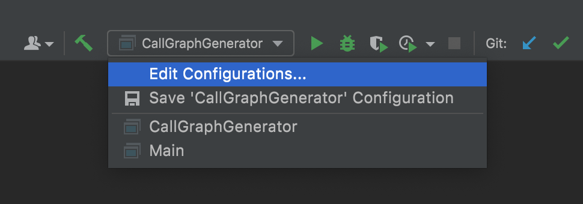

<br />
<p align="center">
 <a href="https://github.com/sassansh/CallGraphGenerator">
    
  </a>
  <h2 align="center">Call Graph Generator Tool</h2>

  <p align="center">
     Design, evaluation and implementation of a Small Program Analysis Tool that generates a Call Graph for your source code!</a>
  <br>
     Built as a group project for UBC <a href="https://courses.students.ubc.ca/cs/courseschedule?pname=subjarea&tname=subj-course&dept=CPSC&course=410">CPSC 410</a> (Advanced Software Engineering).
  </p>
</p>

## Table of Contents

- [Technology Stack 🛠️](#technology-stack-)
- [Prerequisites 🍪](#prerequisites-)
- [Documentation & Setup 🔧](#documentation--setup-)
- [Team ‎😃](#team-)

## Technology Stack 🛠️

#### Backend

- Java
- AST Library: JavaParser

#### Frontend

- React
- Design Framework: Chakra UI
- Charting Library: React Flow

## Prerequisites 🍪

You should have [Git](https://git-scm.com/), [IntelliJ IDEA](https://www.jetbrains.com/idea/download/), and [Node](https://nodejs.org/en/download/) installed on your PC.

## Documentation & Setup 🔧

### Generate output.log analysis file

1. Download the source code for the CallGraphGenerator tool locally

   ```bash
     git clone https://github.com/cpsc410-2021w-t1/Project2Group2
   ```

2. The program that is being analyzed in this example is contained in the inputcode folder (Project2Group2/inputcode). (ie. BankingApp)
3. Open the tool in IntelliJ
4. Navigate to Project2Group2/src/main/java/CallGraphGenerator. Expand the Run drop down and select Edit Configurations

   

5. In the program arguments field, paste in the path to the program you want to analyze. For this example, paste in “inputcode/BankingApp"

   

6. Run the main method in the CallGraphGenerator class. This will output the program, modified with our dynamic analysis.
7. Navigate to the modified program. It will be in this file path: Project2Group2/src/main/java
8. Run the modified program from the main method. This will output a log file (output.log) in the same path as above that contains the logs from the dynamic analysis.

### Visualize call graph using output.log file

1. Now that you have your output.log file generated, we will use that file on the frontend react application
2. Browse to the /frontend/ directory:

   ```bash
     cd frontend
   ```

3. Install dependencies and start the frontend by running:

   ```bash
     yarn install
     yarn start
   ```

4. Your browser should automatically open and take you to: http://localhost:3000
5. You should now see the frontend application, click the Upload Log button to upload your output.log from the previous section:

   

6. A call graph should now be generated for you in the space at the bottom:

   

7. To change the orientation of the graph, show/hide the number calls, show/hide runtimes, change the parent method, or search for a method, use the toolbar:

   

## Team ‎😃

Sassan Shokoohi - [GitHub](https://github.com/sassansh) - [LinkedIn](https://www.linkedin.com/in/sassanshokoohi/) - [Personal Website](https://sassanshokoohi.ca)

Cara Wong - [GitHub](https://github.com/cara-wong) - [LinkedIn](https://www.linkedin.com/in/cara-wong/)

Amir Jafarvand - [GitHub](https://github.com/amirjfr) - [LinkedIn](https://www.linkedin.com/in/amir-jafarvand/) - [Personal Website](http://www.amirjafarvand.com/)

Angela Tian - [GitHub](https://github.com/tiangela1027) - [LinkedIn](https://www.linkedin.com/in/tiangela/) - [Personal Website](https://tiangela1027.github.io)

Anna Takeuchi - [GitHub](https://github.com/annatake) - [LinkedIn](https://www.linkedin.com/in/anna-takeu/?originalSubdomain=ca) - [Personal Website](https://annatakeuchi.dev)
